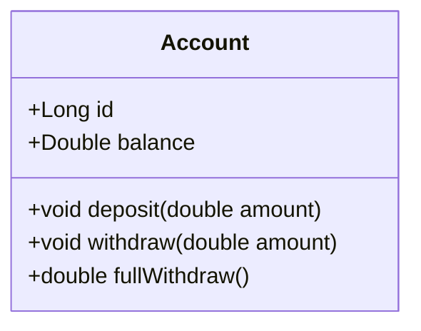

# <a href="https://imgbb.com/"></a> Java Spring Expert - Capítulo 2: Testes automatizados

#### Desenvolvido na linguagem Java por:
- [Marcos Shirafuchi](https://github.com/marcosfshirafuchi)
## Formação Desenvolvedor Moderno Módulo: Back end
<b>Capítulo: Testes automatizados</b>

## Fundamentos de testes automatizados
### Tipos de testes
### Unitário
Teste feito pelo desenvolvedor, responsável por validar o comportamento de unidades funcionais de código. Nesse contexto, entende-se como unidade funcional qualquer porção de código que através de algum estímulo seja capaz de gerar um comportamento esperado (na prática: métodos de uma classe). Um teste unitário não pode acessar outros componentes ou recursos externos (arquivos, bd, rede, web services, etc.).

### Integração
Teste focado em verificar se a comunicação entre componentes / módulos da aplicação, e também recursos externos, estão interagindo entre si corretamente.
### Funcional
É um teste do ponto de vista do usuário, se uma determinada funcionalidade está executando corretamente, produzindo o resultado ou comportamento desejado pelo usuário.

### Beneficios
-	Detectar facilmente se mudanças violaram as regras
-	É uma forma de documentação (comportamento e entradas/saídas esperadas)
-	Redução de custos em manutenções, especialmente em fases avançadas
-	Melhora design da solução, pois a aplicação testável precisa ser bem delineada

## TDD - Test Driven Development
É um método de desenvolver software. Consiste em um desenvolvimento guiado pelos testes.

### Princípios / vantagens:
-	Foco nos requisitos
-	Tende a melhorar o design do código, pois o código deverá ser testável
-	Incrementos no projeto têm menos chance de quebrar a aplicação

### Processo básico:
1. Escreva o teste como esperado (naturalmente que ele ainda estará falhando)
2. Implemente o código necessário para que o teste passe
3. Refatore o código conforme necessidade

## Boas práticas e padrões
### Nomenclatura de um teste
-	<AÇÃO> should <EFEITO> [when <CENÁRIO>]

### Padrão AAA
-	<b>Arrange</b>: instancie os objetos necessários
-	<b>Act</b>: execute as ações necessárias
-	<b>Assert</b>: declare o que deveria acontecer (resultado esperado)

### Princípio da inversão de dependência (SOLID)
-	Se uma classe A depende de uma instância da classe B, não tem como testar a classe A isoladamente. Na verdade nem seria um teste unitário.
-	A inversão de controle ajuda na testabilidade, e garante o isolamento da unidade a ser testada.

### Independência / isolamento
-	Um teste não pode depender de outros testes, nem da ordem de execução

### Cenário único
-	O teste deve ter uma lógica simples, linear
-	O teste deve testar apenas um cenário
-	Não use condicionais e loops

### Previsibilidade  
-	O resultado de um teste deve ser sempre o mesmo para os mesmos dados
-	Não faça o resultado depender de coisas que variam, tais como timestamp atual e valores aleatórios.

## JUnit
### Visão geral
- https://junit.org/junit5
- O primeiro passo é criar uma classe de testes
- A classe pode conter um ou mais métodos com a annotation @Test
- Um método @Test deve ser void
- O objetivo é que todos métodos @Test passem sem falhas
- O que vai definir se um método @Test passa ou não são as “assertions” deste método
- Se um ou mais falhas ocorrerem, estas são mostradas depois da execução do teste

## Principais Tecnologias

-  Java 21 : Utilizaremos a versão LTS mais recente do Java para tirar vantagem das últimas inovações que essa linguagem robusta e amplamente utilizada oferece;
-  JUnit 5.8.1 : Usamos o Junit 5.8 para fazer os testes unitários
<br><br>


## Diagrama de classe


Uma conta possui 2 dados:
- Id: Numero da conta
- Balance: saldo da conta

E possui 3 métodos:
- Deposit: método que faz o depósito e desconto 2% do valor do deposito se o valor for positivo.
- Withdraw: método que faz o saque, se o valor do saque for menor ou igual o valor da conta(balance).
- FullWithdraw: método que saca todo o valor da conta.

## Testes Unitários
### O teste depositShouldIncreaseBalanceAndDiscountFeeWhenPositiveAmount()
````
@Test
    //Nomenclatura de um teste
    // <AÇÃO> should <EFEITO> [when <CENÁRIO>]
    public void depositShouldIncreaseBalanceAndDiscountFeeWhenPositiveAmount(){
        /*
            Padrão AAA
            Arrange: instancie os objetos necessários
        */
        double amount = 200.0;
        double expectedValue = 196.0;
        //Account acc = new Account(1L,0.0);

        //Outra forma de instanciar
        Account acc = AccountFactory.createEmptyAccount();

        //Act: execute as ações necessárias
        acc.deposit(amount);

        //Assert: declare o que deveria acontecer (resultado esperado)
        //Valor experado, valor do conta
        Assertions.assertEquals(expectedValue,acc.getBalance());
    }
````

### O teste depositShouldDoNothingWhenNegativeAmount()
````
@Test
    //Nomenclatura de um teste
    // <AÇÃO> should <EFEITO> [when <CENÁRIO>]
    public void depositShouldDoNothingWhenNegativeAmount(){
        /*
            Padrão AAA
            Arrange: instancie os objetos necessários
        */
        double expectedValue = 100.0;
        //Account acc = new Account(1L,expectedValue);
        //Outra forma de instanciar
        Account acc = AccountFactory.createAccount(expectedValue);
        double amount = -200.0;

        //Act: execute as ações necessárias
        acc.deposit(amount);

        //Assert: declare o que deveria acontecer (resultado esperado)
        //Valor experado, valor do conta
        Assertions.assertEquals(expectedValue, acc.getBalance());
    }
````
### O teste fullWithdrawShouldClearBalanceAndReturnFullBalance()
````
@Test
    //Nomenclatura de um teste
    // <AÇÃO> should <EFEITO> [when <CENÁRIO>]
    public void fullWithdrawShouldClearBalanceAndReturnFullBalance(){
	/*
		Padrão AAA
		Arrange: instancie os objetos necessários
	*/
        double expectedValue = 0.0;
        double initialBalance = 800.0;
        Account acc = AccountFactory.createAccount(initialBalance);

        //Act: execute as ações necessárias
        double result = acc.fullWithdraw();

        //Assert: declare o que deveria acontecer (resultado esperado)
        Assertions.assertTrue(expectedValue == acc.getBalance());
        Assertions.assertTrue(result == initialBalance);
    }
````

### O teste withdrawShouldDecreaseBalanceWhenSufficientBalance()
````
@Test
    //Nomenclatura de um teste
    // <AÇÃO> should <EFEITO> [when <CENÁRIO>]
    public void withdrawShouldDecreaseBalanceWhenSufficientBalance(){
        /*
		    Padrão AAA
		    Arrange: instancie os objetos necessários
	    */
        Account acc = AccountFactory.createAccount(800.0);

        //Act: execute as ações necessárias
        acc.withdraw(500.0);

        //Assert: declare o que deveria acontecer (resultado esperado)
        Assertions.assertEquals(300.0, acc.getBalance());
    }
````
### O teste withdrawShouldThrowExceptionWhenInsufficientBalance()
````
 @Test
    //Nomenclatura de um teste
    // <AÇÃO> should <EFEITO> [when <CENÁRIO>]
    public void withdrawShouldThrowExceptionWhenInsufficientBalance(){

        //Assert: declare o que deveria acontecer (resultado esperado)
        //Exceção e o método lambda para instanciar os objetos e as ações
        Assertions.assertThrows(IllegalArgumentException.class,()->{
          /*
		        Padrão AAA
		        Arrange: instancie os objetos necessários
	        */
            Account acc = AccountFactory.createAccount(800.0);
            //Act: execute as ações necessárias
            acc.withdraw(801.0);
        });
    }
````
